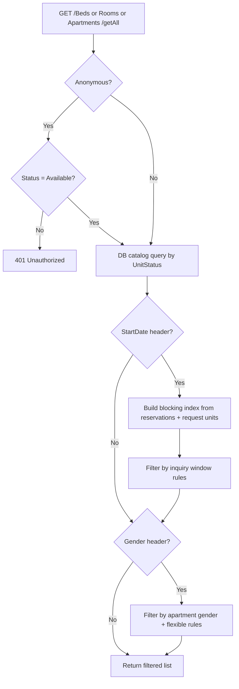

# Backend Availability Filter — Step-by-Step Flow

How the backend filters available units when the frontend calls `Apartments/getAll`, `Rooms/getAll`, or `Beds/getAll`.

## Entry point

Each unit type uses the **same pipeline** in its controller (`ApartmentsController`, `RoomsController`, `BedsController`). The frontend sends these headers:

| Header | Purpose |
|--------|---------|
| `Status: Available` | Required for anonymous users |
| `StartDate` | Inquiry check-in date (e.g. `2026-06-21`) |
| `Nights` | Length of stay |
| `Gender` | `Male` / `Female` (and Arabic aliases) |

**Key source files:**

- `SonoBooking.Api/Controllers/V1/Housing/ApartmentsController.cs`
- `SonoBooking.Api/Controllers/V1/Housing/RoomsController.cs`
- `SonoBooking.Api/Controllers/V1/Housing/BedsController.cs`
- `SonoBooking.Application/Services/Housing/Availability/AvailabilityCatalogStatus.cs`
- `SonoBooking.Application/Services/Housing/Availability/AvailabilityInquiryFilter.cs`
- `SonoBooking.Application/Services/Housing/Availability/UnitOccupancyService.cs`
- `SonoBooking.Application/Services/Housing/Availability/UnitBlockingEndIndex.cs`

---

## Step 1 — Auth + catalog load (database query)

1. **Anonymous check**  
   If the caller is not logged in, `Status` must be `Available` or `متاح`; otherwise `401`.

2. **Catalog status filter** (`AvailabilityCatalogStatus`)  
   Loads units from the database with a status predicate:

   - **No `StartDate`:** only `Available` units.
   - **With `StartDate`:** `Available`, `Reserved`, and `Occupied` (date logic decides later).

3. **Result:** raw list of apartments, rooms, or beds from DB.

---

## Step 2 — Build blocking index (only when `StartDate` is set)

`UnitOccupancyService.BuildBlockingEndIndexAsync()` builds a lookup of active bookings:

1. Load all non-canceled reservations → checkout end per request (`ActualCheckOutDate` or `EndDate`).
2. Merge approved **`Extensions`** entity end dates (`ReservationId` → request).
3. Merge approved **request** `EndDate`; for `RequestCatagory.Extension`, roll end onto the **root** stay via `PreviousRequestId` chain.
4. Load all **approved** requests → start date per request (`nextApprovedStart`).
5. Load all `RequestUnits` linked to those requests.
6. For each request unit, **skip stays already ended** before the inquiry date.
7. Apply blocking only on the **most specific** unit:
   - `BedId` → block that bed only
   - else `RoomId` → block that room only
   - else `ApartmentId` → block whole apartment

   For each blocked unit it stores:

   - **blocking end** (checkout date)
   - **next approved start** (request start date)

This supports **flexible apartments**: booking one bed does not block sibling beds.

---

## Step 3 — Date / occupancy filter

`FilterApartmentsAsync` / `FilterRoomsAsync` / `FilterBedsAsync` runs per unit.

For each unit it reads:

- **Blocking end** — from bed/room/apartment index (beds/rooms also roll up from parent apartment when the whole apartment is booked).
- **Next approved start** — earliest approved request start on that unit.

Then `IsUnitFreeForInquiryWindow()` applies these rules **in order**:

### 3a. Noon checkout rule

Inquiry starts at **12:00:01** on the selected day.  
Blocking ends at **12:00** on checkout day.

Example: checkout on 21-06 → unit is bookable again from 21-06 12:00:01.

### 3b. Active occupancy rule

Hide when an approved stay **already started on or before** the inquiry date **and** is still blocked at inquiry start (uses the same **noon rule** as 3a — checkout day is bookable from 12:00:01).

### 3c. Nights overlap rule (only if `Nights` > 0)

- If the past stay already ended → **show**.
- If the next approved stay is in the **past** → **show**.
- If the next approved stay is in the **future** → show only when  
  `inquiryEnd < nextApprovedStart`  
  (your stay ends before the next guest arrives).

### 3d. Apartment extra rule

An apartment is kept only if:

- it passes the rules above, **and**
- it has a **whole-apartment** booking entry in the index, **or**
- at least **one child room or bed** is free for the same inquiry window.

This avoids showing an apartment card with no available children.

---

## Step 4 — Gender filter (if `Gender` header is sent)

### Fixed apartments

Unit is shown only if apartment gender matches the search gender.

### Flexible apartments (`AllocationType.Flexible`)

`GetFlexibleApartmentAllowedGendersAsync()`:

1. Find which beds/rooms are occupied at inquiry time (status or blocking index).
2. Read genders of users on those active approved reservations.
3. Build extra allowed genders per apartment:
   - **All children free** → allow **Male + Female**.
   - **Partially occupied** → allow genders that match current occupants (plus apartment’s own gender if it matches).

Beds and rooms inherit gender rules from their **parent apartment**.

---

## Flow diagram

---

## Important details

1. **Three separate API calls** — apartments, rooms, and beds are filtered independently; the frontend then wires parent/child IDs.
2. **Catalog vs occupancy** — `UnitStatus` in DB is a first pass; real availability for dated searches comes from reservations + approved requests.
3. **Leaf-level blocking** — bed bookings block only that bed; sibling units can still appear.
4. **Apartment rollup** — whole-apartment bookings still block all children via `GetBedBlockingEnd` / `GetRoomBlockingEnd` reading the apartment index.
5. **No allocation-type header** — `AllocationType` is not sent from the frontend; flexible rules are derived from the apartment record in the database.
6. **Extensions** — blocking end uses reservation checkout, `Extensions` table, and extension requests (`PreviousRequestId`). See [availability-inquiry-chat-summary.md](./availability-inquiry-chat-summary.md).

**See also:** [available-unit-search-flow.md](./available-unit-search-flow.md) — end-to-end search from UI through API and back.

---

## Frontend follow-up (after API)

The frontend (`fetchMergedAvailabilityCards` in `Front/src/lib/availability-inquiry.ts`):

1. Calls all three `getAll` endpoints in parallel with the same headers.
2. Applies `applyAvailabilityHierarchyFilters` — keeps rooms whose parent apartment is in the apartment list, and beds whose parent room is in the room list.
3. Enriches and merges cards for display.

Date occupancy is handled entirely by the API when `StartDate` is set; the frontend hierarchy step only wires parent/child relationships.
