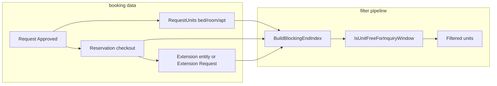

# Availability Inquiry — Chat Session Summary

Summary of the availability search investigation and fixes from the June 2026 session.  
**Related docs:**

- [availability-filter-flow.md](./availability-filter-flow.md) — backend pipeline detail
- [available-unit-search-flow.md](./available-unit-search-flow.md) — full stack UI → API → UI flow

---

## What we were solving

Users search for housing units with **StartDate** and **Nights**. The backend must hide units that are blocked by **approved requests** and **active reservations**, while respecting the **noon checkout** rule and **extension** stays.

**API entry:** `GET /api/v1/{Apartments|Rooms|Beds}/getAll` with headers `Status`, `StartDate`, `Nights`, `Gender`.

**Frontend entry:** `fetchMergedAvailabilityCards` → three parallel `getAll` calls → `applyAvailabilityHierarchyFilters`.

---

## Architecture (short)



| Entity | Role in filter |
|--------|----------------|
| **Request** | Defines **which units** are booked (`RequestUnits`), **start** (`StartDate`), and **planned end** (`EndDate`). Only **Approved** requests count. |
| **Reservation** | Confirmed stay linked via `Reservation.RequestId`. Provides **checkout end** (`ActualCheckOutDate` or `EndDate`). |
| **Extension** | Two forms: `RequestCatagory.Extension` request (`PreviousRequestId` → original stay) and `booking.Extensions` row (`ReservationId`). Both extend blocking end past the original checkout. |

**Important:** Extension requests usually **do not** have their own `RequestUnits` — units stay on the **original** request. Blocking end must be rolled up to that root request.

---

## Issues reported and fixes

### Issue 1 — Search start date = request checkout date

**Symptom:** When inquiry `StartDate` equals the request/reservation end date, units did not appear even though the noon rule says they should be bookable the same day after checkout.

**Rule:**

- Inquiry starts at **12:00:01** on the selected day.
- Blocking ends at **12:00:00** on checkout day.
- Example: checkout **21-06** → bookable from **21-06 12:00:01**.

**Root cause:** `IsUnitFreeForInquiryWindow` had an “enhanced” rule that hid units when `blockingEnd >= inquiryStart`, which conflicted with the noon rule on the checkout day itself.

**Fix** (`UnitOccupancyService.cs`):

```csharp
// Before (wrong on checkout day):
// blockingEnd >= inquiryStart → hide

// After (aligned with noon rule):
if (nextApprovedStart <= inquiryStart &&
    !IsUnitFreeOnInquiryStart(inquiryStart, blockingEnd))
    return false;
```

---

### Issue 2 — Extension category: units still visible during active extension

**Symptom:** Approved extension (e.g. 21–28) did not hide units when searching during the extension window. “Old” request units appeared in inquiry results.

**Root cause:** `BuildBlockingEndIndexAsync` only used reservation checkout keyed by `Reservation.RequestId` (the **original** stay). It ignored:

1. Approved **`Extensions`** table rows (`EndDate` per `ReservationId`).
2. Approved **`RequestCatagory.Extension`** requests whose `EndDate` extends the stay.
3. Units on the original request while reservation `EndDate` was still the **pre-extension** date.

**Fix** (`UnitOccupancyService.BuildBlockingEndIndexAsync`):

1. Build `requestEndById` from reservations (as before).
2. Merge approved **`Extensions`** end dates via `ReservationId` → `RequestId`.
3. Merge approved request **`EndDate`** for all approved requests.
4. For extension requests, walk **`PreviousRequestId`** chain and merge `EndDate` onto the **root stay** request id.
5. Map `RequestUnits` using the merged end dates (leaf-level blocking unchanged).

**Frontend mirror** (`Front/src/lib/availability-occupancy.ts`): `buildUnitBlockingEndIndex` now uses `extensionsRaw` and extension requests the same way (for client-side flows that build the index locally).

---

### Earlier related fixes (same session)

| Problem | Fix |
|---------|-----|
| Only apartment cards showed, not rooms/beds | Leaf-level blocking + apartment must have free child OR whole-apartment booking (`HasDirectApartmentBooking`, `GetApartmentIdsWithAvailableChildrenAsync`). |
| Completed stays hid units on future inquiries | Skip index entries when `endYmd < inquiryStart`; nights overlap only for **future** `nextApprovedStart`. |
| Bed blocked entire room/apartment | Blocking applied only on most specific unit (bed → bed only, etc.). |

---

## How date filter works (request + reservation)

### Step 1 — Catalog (DB)

- No `StartDate` → only `Available` units.
- With `StartDate` → `Available`, `Reserved`, `Occupied` (date logic refines later).

### Step 2 — Blocking index

For each `RequestUnit` on an approved request with a resolved end date:

| Index field | Source |
|-------------|--------|
| `blockingEnd` | Max checkout: reservation, extension entity, extension request, request `EndDate` |
| `nextApprovedStart` | Earliest approved `Request.StartDate` on that unit |

Skipped when stay ended before inquiry (`endYmd < inquiryStart`).

### Step 3 — Per-unit rules (`IsUnitFreeForInquiryWindow`)

1. **Noon rule** — free at inquiry start?
2. **Active occupancy** — approved stay started on/before inquiry and still blocked at inquiry start?
3. **Nights overlap** — if `Nights > 0` and a **future** approved stay exists: `inquiryEnd < nextApprovedStart`
4. **Apartments only** — must have direct whole-apartment booking or at least one free child room/bed.

### Step 4 — Gender (optional)

Fixed apartments by gender; flexible apartments use occupant genders at inquiry time.

---

## Test scenarios

| Scenario | Expected |
|----------|----------|
| Active stay / extension 21–28, search **21-06**, 7 nights | Units **hidden** |
| Checkout **21-06**, search start **21-06** | Units **shown** (noon rule) |
| After extension ends (e.g. **29-06+**) | Apartment + room + bed **shown** if free |
| Flexible apartment, one bed booked | Other beds in same apartment **still shown** |
| No `StartDate` | Only catalog-`Available` units |

---

## Files changed in this session

### Backend

| File | Change |
|------|--------|
| `SonoBooking.Application/.../UnitOccupancyService.cs` | Noon-aligned enhanced rule; extension end rollup in `BuildBlockingEndIndexAsync`; helpers `MergeRequestEnd`, `ResolveRootStayRequestId` |
| `SonoBooking.Application/.../AvailabilityInquiryFilter.cs` | Apartment child-availability check |
| `SonoBooking.Application/.../UnitBlockingEndIndex.cs` | `HasDirectApartmentBooking()` |
| `SonoBooking.Application/.../IUnitOccupancyService.cs` | `GetApartmentIdsWithAvailableChildrenAsync` |
| `docs/availability-filter-flow.md` | Pipeline documentation |

### Frontend

| File | Change |
|------|--------|
| `Front/src/lib/availability-occupancy.ts` | Extension + extension-request end merge in `buildUnitBlockingEndIndex` |
| `Front/src/lib/availability-hierarchy.ts` | Parent/child wiring after API filter |
| `Front/src/actions/availabilityService.ts` | Parallel `getAll` with inquiry headers |

---

## Operations note

After backend changes, **restart IIS Express / API** (`SonoBooking.Api` locks DLLs while running). Dev API: `http://localhost:57951/api/v1`.

---

## Key code references

**Noon rule:**

```csharp
inquiryStart.ToDateTime(new TimeOnly(12, 0, 1)) >
blockingEnd.Value.ToDateTime(new TimeOnly(12, 0, 0));
```

**Request ↔ reservation link:** `Reservation.RequestId` → original approved request; `RequestUnits.RequestId` → same id for unit mapping.

**Extension link:** `Request.PreviousRequestId` → original stay; `Extension.ReservationId` → reservation of original stay.
