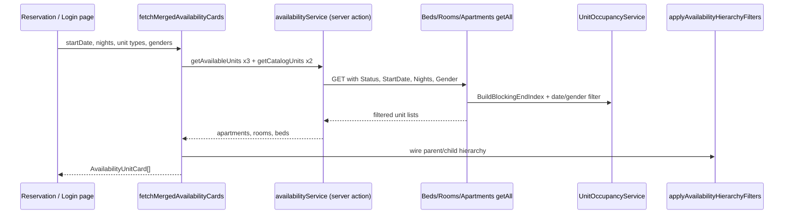

# Available Unit Search — Backend to Frontend Flow

End-to-end steps for how a user searches for available housing units, from the UI through the API and back to displayed cards.

**Related docs:**

- [availability-filter-flow.md](./availability-filter-flow.md) — backend filter pipeline (detailed)
- [availability-inquiry-chat-summary.md](./availability-inquiry-chat-summary.md) — session fixes and request/reservation roles

---

## Overview



| Layer | Main files |
|-------|------------|
| UI | `Front/src/app/[locale]/reservation/page.tsx`, `Front/src/components/auth/login-form.tsx` |
| Orchestration | `Front/src/lib/availability-inquiry.ts` |
| Server actions | `Front/src/actions/availabilityService.ts` |
| Hierarchy | `Front/src/lib/availability-hierarchy.ts` |
| API | `Back/SonoBooking.Api/Controllers/V1/Housing/{Apartments,Rooms,Beds}Controller.cs` |
| Occupancy | `Back/SonoBooking.Application/Services/Housing/Availability/UnitOccupancyService.cs` |

---

## Phase 1 — User fills the search form (Frontend UI)

**Pages:** reservation page, login form (pre-auth availability check)

User enters:

| Field | Example | Notes |
|-------|---------|--------|
| Start date | `2026-06-21` | Normalized to `YYYY-MM-DD` |
| Nights | `7` | Optional; enables overlap rule on backend |
| Unit types | bed / room / apartment | One or more |
| Gender | male / female | Optional |

On **Check availability**, the page calls:

```ts
fetchMergedAvailabilityCards(kinds, { startDateYmd, nights, genders })
```

---

## Phase 2 — Frontend prepares parallel API calls

**File:** `Front/src/lib/availability-inquiry.ts` → `fetchMergedAvailabilityCards`

1. If **start date** is set, always fetches **all three** unit types (apartment, room, bed) so parent/child hierarchy can be wired — even when the user only selected one type.
2. Loads **catalog** beds and rooms via `getCatalogUnits` (all statuses, no `Status` header) for reserved-child hierarchy checks.
3. Calls `getAvailableUnits(unitType, inquiry)` in parallel for each type needed.

---

## Phase 3 — Server action calls the backend

**File:** `Front/src/actions/availabilityService.ts`

### `getAvailableUnits(unitType, inquiry)`

Builds HTTP headers and calls the API:

| Header | Value |
|--------|--------|
| `Status` | `Available` (required for anonymous callers) |
| `StartDate` | e.g. `2026-06-21` when date search |
| `Nights` | e.g. `7` when > 0 |
| `Gender` | `Male` / `Female` (comma-separated if multiple) |

**Endpoints:**

```
GET {BACK_END}/Beds/getAll
GET {BACK_END}/Rooms/getAll
GET {BACK_END}/Apartments/getAll
```

Uses `axios-auth` in a Next.js server action (`process.env.BACK_END`).

### `getCatalogUnits` (supporting)

Same bed/room endpoints **without** the `Status` header — returns all statuses for hierarchy reserved-child logic.

---

## Phase 4 — Backend controller (each unit type)

**Files:** `BedsController.cs`, `RoomsController.cs`, `ApartmentsController.cs`

Each `getAll` runs the **same pipeline**.

### Step 4.1 — Auth check

- Anonymous user **must** send `Status: Available` or `متاح`.
- Otherwise → `401 Unauthorized`.

### Step 4.2 — Catalog query (database)

**File:** `AvailabilityCatalogStatus.cs`

| Has `StartDate`? | Units loaded from DB |
|------------------|----------------------|
| No | Only `Available` |
| Yes | `Available`, `Reserved`, and `Occupied` |

Occupancy/date rules in the next step decide which rows stay in the response.

### Step 4.3 — Date / occupancy filter (only if `StartDate` is set)

**Files:** `AvailabilityInquiryFilter.cs`, `UnitOccupancyService.cs`

#### A) Build blocking index

`BuildBlockingEndIndexAsync()`:

1. **Reservations** (not canceled / no-show) → checkout end per `RequestId` (`ActualCheckOutDate` or `EndDate`).
2. **Approved Extensions** entity → merge `EndDate` via `ReservationId` → request.
3. **Approved Requests** → merge `EndDate`; extension requests (`RequestCatagory.Extension`) roll onto root stay via `PreviousRequestId` chain.
4. **RequestUnits** → for each approved request with an end date, map to bed / room / apartment:
   - **blockingEnd** — latest checkout on that unit
   - **nextApprovedStart** — earliest approved request start on that unit

Rules when indexing:

- Skip stays already ended before inquiry (`endYmd < inquiryStart`).
- Apply blocking on the **most specific** unit only (bed → bed; room → room; apartment → whole apartment). Supports **flexible apartments** where sibling beds can remain available.

#### B) Per-unit window check

`IsUnitFreeForInquiryWindow(inquiryStart, nights, blockingEnd, nextApprovedStart)`:

| Rule | Description |
|------|-------------|
| **Noon checkout** | Inquiry at **12:00:01** on start day; blocking ends **12:00** on checkout day. Checkout 21-06 → bookable from 21-06 12:00:01. |
| **Active occupancy** | Hide if approved stay started on/before inquiry and is still blocked at inquiry start (same noon rule). |
| **Nights overlap** | If `Nights > 0` and a **future** approved stay exists: show only when `inquiryEnd < nextApprovedStart`. |
| **Apartment extra** | Apartment shown only if whole-apartment booking in index **or** at least one child room/bed is free for the same window. |

#### C) Data roles (request vs reservation)

| Entity | Role |
|--------|------|
| **Request** (Approved) | Which units (`RequestUnits`), stay **start**, planned **end** |
| **Reservation** | Confirmed checkout linked by `Reservation.RequestId` |
| **Extension** | Extends blocking end past original checkout (entity table or extension request) |

### Step 4.4 — Gender filter (if `Gender` header)

- **Fixed apartments** — unit shown only if apartment gender matches search.
- **Flexible apartments** — `GetFlexibleApartmentAllowedGendersAsync()` derives allowed genders from occupants at inquiry time.

### Step 4.5 — Response

Returns filtered `BedDto` / `RoomDto` / `ApartmentDto` JSON array to the frontend.

---

## Phase 5 — Frontend post-processing

Back in `fetchMergedAvailabilityCards`:

### Step 5.1 — Optional occupancy index (logged-in users)

`loadUnitBlockingEndIndex()` loads requests, reservations, extensions, and request units and builds a client-side `UnitBlockingEndIndex`.

- Used for **extend** flows and hierarchy edge cases.
- **Main date filtering** for search is done on the API when `StartDate` is sent.

### Step 5.2 — Hierarchy filter

**File:** `Front/src/lib/availability-hierarchy.ts` → `applyAvailabilityHierarchyFilters`

| Rule | Purpose |
|------|---------|
| Room must belong to an apartment in the apartment list | Parent wiring |
| Bed must belong to a room in the room list | Parent wiring |
| Hide apartments with reserved children not in results | Avoid misleading parent cards |
| Hide rooms with reserved beds not in results | Same for room-level search |

When `StartDate` is set, date blocking is **already applied by the API**. The frontend wires **parent ↔ child** relationships and handles **reserved catalog** edge cases.

### Step 5.3 — Build display cards

`enrichAvailabilityCards()` adds labels, bed counts, images, and hierarchy names → `AvailabilityUnitCard[]`.

Only the **unit types the user selected** are included in the final merged card list.

---

## Phase 6 — UI shows results

1. `setAvailabilityCards(cards)` on the page.
2. User selects cards → saved to `localStorage` (`reservation`) for the booking request flow.
3. **Extend** flow may use `occupancyIndex` to verify current stay units are still free before showing them.

---

## Quick reference — numbered steps

| # | Layer | What happens |
|---|--------|----------------|
| 1 | UI | User submits date, nights, types, gender |
| 2 | FE lib | `fetchMergedAvailabilityCards` orchestrates calls |
| 3 | Server action | `getAvailableUnits` × 3 with inquiry headers |
| 4 | API | Auth + catalog DB query |
| 5 | API | Blocking index from Request + Reservation + Extension |
| 6 | API | Noon / overlap / apartment-child rules per unit |
| 7 | API | Gender filter |
| 8 | FE | Hierarchy: apartment → room → bed |
| 9 | FE | Enrich rows → `AvailabilityUnitCard` |
| 10 | UI | Show cards; user selects units |

---

## What lives where

| Concern | Where handled |
|---------|----------------|
| Real date availability | Backend `UnitOccupancyService` |
| Which units are booked | `RequestUnits` + approved `Requests` |
| Checkout end date | `Reservations` + extensions |
| Parent/child display wiring | Frontend `availability-hierarchy.ts` |
| Card UI / enrichment | `availability-inquiry.ts` + reservation/login pages |

---

## Environment

- Frontend API base: `BACK_END` in `Front/.env` (e.g. `http://localhost:57951/api/v1`).
- After backend filter changes, restart IIS Express / `SonoBooking.Api` so new DLLs load.
